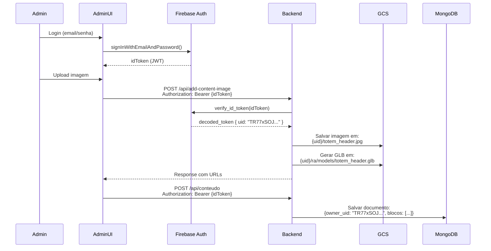
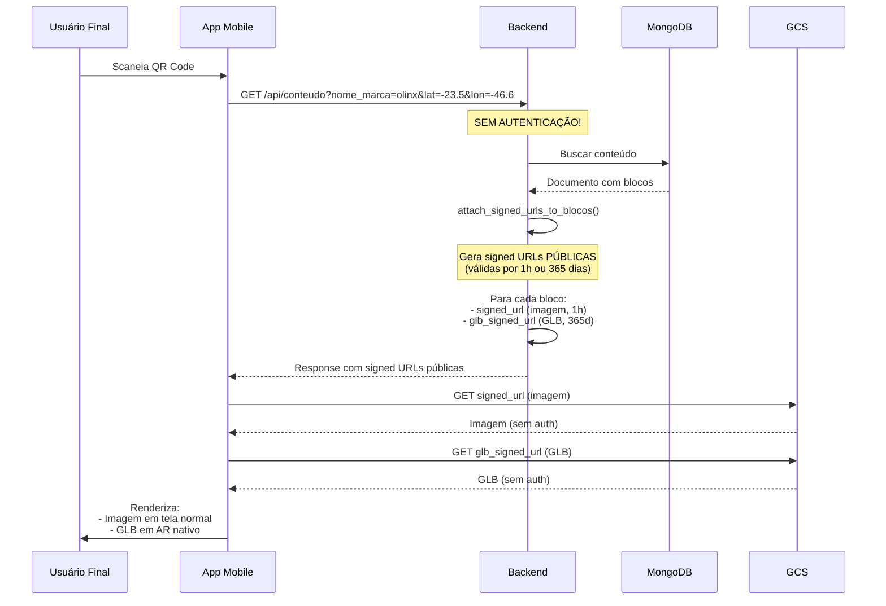

# 🔐 Duas Camadas de Acesso - OlinxRA

## Visão Geral

O sistema OlinxRA possui **duas camadas de acesso completamente separadas**:

1. **🔐 AdminUI (Autenticado)** - Gerenciamento de conteúdo
2. **🌐 App Mobile (Público)** - Visualização de conteúdo

---

## 🔐 Camada 1: AdminUI (Autenticado)

### Objetivo
Permitir que **admins** façam upload e gerenciem conteúdo de forma **isolada** (Admin A não vê arquivos do Admin B).

### Fluxo de Autenticação



### Endpoints Protegidos (Requerem Auth)

| Endpoint | Método | Requer Auth | Uso |
|----------|--------|-------------|-----|
| `/api/add-content-image` | POST | ✅ Sim | Upload de imagens |
| `/api/conteudo` (POST) | POST | ✅ Sim | Salvar conteúdo |
| `/api/upload-logo` | POST | ✅ Sim | Upload de logos |
| `/api/delete-logo` | DELETE | ✅ Sim | Deletar logos |
| `/api/list-users` | GET | ✅ Sim | Listar admins |

### Isolamento de Arquivos

**Estrutura no GCS:**
```
olinxra-conteudo/
├── TR77xSOJ.../              ← Admin A (olinxra.adm@gmail.com)
│   ├── totem_header.jpg
│   ├── produto_1.jpg
│   └── ra/
│       └── models/
│           ├── totem_header.glb
│           └── produto_1.glb
│
└── yiF2ZJyB.../              ← Admin B (dalcin.tools@outlook.com)
    ├── banner.jpg
    └── ra/
        └── models/
            └── banner.glb
```

**Validação no Backend:**
```python
@app.post('/api/add-content-image')
async def add_content_image(
    file: UploadFile,
    token: dict = Depends(verify_firebase_token_dep)  # ← AUTENTICAÇÃO OBRIGATÓRIA
):
    owner_uid = token['uid']  # Extrai UID do token
    
    # Salva isolado por usuário
    gcs_filename = f"{owner_uid}/{name}.jpg"
    glb_filename = f"{owner_uid}/ra/models/{name}.glb"
    
    # Admin A não consegue salvar em pasta do Admin B
```

---

## 🌐 Camada 2: App Mobile (Público)

### Objetivo
Permitir que **usuários finais** (público) visualizem conteúdo **sem precisar fazer login**.

### Fluxo de Acesso Público



### Endpoints Públicos (Sem Auth)

| Endpoint | Método | Requer Auth | Uso |
|----------|--------|-------------|-----|
| `/api/conteudo` (GET) | GET | ❌ Não | Buscar conteúdo por marca/localização |
| `/api/conteudo-por-regiao` | GET | ❌ Não | Buscar conteúdo por marca/região |
| `/api/conteudo-signed-url` | GET | ❌ Não | Gerar signed URL on-demand |
| `/api/generate-glb-from-image` | POST | ❌ Não* | Gerar GLB (usado pelo app) |

*Nota: `/api/generate-glb-from-image` pode ser configurado para exigir auth via variável `GLB_REQUIRE_AUTH=true`

### Como funciona o acesso sem autenticação?

#### 1. **Signed URLs temporárias**

```python
# Backend: endpoints públicos
@app.get('/api/conteudo')
async def get_conteudo(
    nome_marca: str,
    latitude: float,
    longitude: float
    # ❌ SEM token: dict = Depends(verify_firebase_token_dep)
):
    # Buscar documento no MongoDB
    conteudo = await buscar_conteudo_por_marca(nome_marca, lat, lon)
    
    # Gerar signed URLs PÚBLICAS para as imagens e GLBs
    await attach_signed_urls_to_blocos(conteudo['blocos'])
    
    return conteudo
```

#### 2. **Response com URLs públicas**

```json
{
  "blocos": [
    {
      "tipo": "imagem",
      "url": "gs://olinxra-conteudo/TR77xSOJ.../totem_header.jpg",
      "signed_url": "https://storage.googleapis.com/olinxra-conteudo/TR77xSOJ.../totem_header.jpg?X-Goog-Expires=3600...",
      "glb_url": "gs://olinxra-conteudo/TR77xSOJ.../ra/models/totem_header.glb",
      "glb_signed_url": "https://storage.googleapis.com/olinxra-conteudo/TR77xSOJ.../ra/models/totem_header.glb?X-Goog-Expires=31536000..."
    }
  ]
}
```

#### 3. **App usa signed URLs diretamente**

```typescript
// App Mobile (React Native)
const payload = await fetchPayload();

// Carregar imagem em tela normal
<Image source={{ uri: payload.blocos[0].signed_url }} />

// Carregar GLB em AR
<ARLauncher modelUrl={payload.blocos[0].glb_signed_url} />
```

**✅ Sem autenticação necessária!** Signed URLs são **públicas temporariamente**.

---

## 🔐 Segurança das Signed URLs

### Como impedir que Admin A veja arquivos do Admin B?

**Problema potencial:**
```
Admin A cria conteúdo → signed_url gerada
Admin B descobre a signed_url → consegue acessar?
```

**✅ Resposta: NÃO consegue modificar o path**

**Signed URLs são assinadas criptograficamente:**
```
https://storage.googleapis.com/olinxra-conteudo/TR77xSOJ.../totem.jpg?
  X-Goog-Signature=abc123def456...
  └─ Assinatura válida apenas para este path exato
```

**Tentativa de hack (FALHA):**
```bash
# URL original (válida)
https://storage.googleapis.com/.../TR77xSOJ.../totem.jpg?X-Goog-Signature=abc123

# Tentativa de mudar path (FALHA)
https://storage.googleapis.com/.../yiF2ZJyB.../banner.jpg?X-Goog-Signature=abc123
                                 └─ Path diferente ─┘  └─ Assinatura INVÁLIDA ❌

# Resultado: 403 Forbidden
```

**Por quê funciona?**
1. Backend assina a URL com **chave privada** do Service Account
2. Assinatura valida **exatamente** o path do arquivo
3. GCS verifica assinatura antes de permitir acesso
4. Path diferente = assinatura inválida = 403 Forbidden

### Tempo de Expiração

| Tipo | Expiração | Motivo | Endpoint |
|------|-----------|--------|----------|
| **Imagens** | 1 hora | Preview rápido | `/api/conteudo` |
| **GLBs** | 365 dias | App usa por longo tempo | `/api/conteudo` |
| **Admin Preview** | 1 hora | Upload no AdminUI | `/api/add-content-image` |

**Por quê GLBs têm expiração longa?**
- ✅ App mobile não precisa regenerar constantemente
- ✅ GLBs são arquivos estáticos (raramente mudam)
- ✅ Performance melhor (menos requests)
- ✅ Funciona offline após 1º download

---

## 📊 Comparação das Camadas

| Aspecto | AdminUI (Autenticado) | App Mobile (Público) |
|---------|----------------------|---------------------|
| **Usuário** | Admin (email/senha) | Usuário final (anônimo) |
| **Autenticação** | ✅ Firebase Auth (JWT) | ❌ Nenhuma |
| **Endpoints** | POST /api/conteudo<br/>POST /api/add-content-image | GET /api/conteudo<br/>GET /api/conteudo-por-regiao |
| **Acesso a arquivos** | Via token (isolado por UID) | Via signed URLs (públicas temporárias) |
| **Isolamento** | {owner_uid}/ | Signed URLs validam path exato |
| **Finalidade** | Gerenciamento | Visualização |
| **Exemplo de uso** | Upload de imagens | Scanear QR Code e ver AR |

---

## 🔄 Fluxo Completo (End-to-End)

### 1. Admin cria conteúdo (Autenticado)
```
Admin → AdminUI → Login → Firebase Auth → idToken
                          ↓
                    Backend valida token → owner_uid = "TR77xSOJ..."
                          ↓
                    Salva em: TR77xSOJ.../totem.jpg
                              TR77xSOJ.../ra/models/totem.glb
                          ↓
                    MongoDB: {owner_uid: "TR77xSOJ...", blocos: [...]}
```

### 2. Usuário final acessa (Público)
```
Usuário → App → Scaneia QR Code → extrai nome_marca + lat/lon
                    ↓
              Backend busca conteúdo (SEM AUTH)
                    ↓
              MongoDB retorna documento
                    ↓
              Backend gera signed URLs públicas:
                - signed_url (imagem, 1h)
                - glb_signed_url (GLB, 365d)
                    ↓
              App recebe payload com signed URLs
                    ↓
              App renderiza:
                - Imagem em ContentBlocks (signed_url)
                - GLB em ARLauncher (glb_signed_url)
                    ↓
              ✅ Usuário vê conteúdo SEM LOGIN!
```

---

## ✅ Validação da Implementação

### Código atualizado:

#### 1. **Função `attach_signed_urls_to_blocos`** (linha 350)
```python
async def attach_signed_urls_to_blocos(blocos):
    """
    Gera signed URLs PÚBLICAS para endpoints que o app mobile usa SEM autenticação.
    - signed_url (imagem): expiração 1h
    - glb_signed_url (GLB): expiração 365 dias
    """
    for bloco in blocos:
        # Imagem original
        if bloco.get('url'):
            bloco['signed_url'] = gerar_signed_url_conteudo(bloco['url'])
        
        # 🆕 GLB pré-gerado
        if bloco.get('glb_url'):
            bloco['glb_signed_url'] = gerar_signed_url_conteudo(
                bloco['glb_url'],
                expiration=365*24*60*60  # 1 ano
            )
```

#### 2. **Endpoint público `/api/conteudo`** (linha 1289)
```python
@app.get('/api/conteudo')
async def get_conteudo(
    nome_marca: str,
    latitude: float,
    longitude: float
    # ❌ SEM Depends(verify_firebase_token_dep)
):
    conteudo = await buscar_conteudo_por_marca(...)
    
    # Gera signed URLs públicas
    await attach_signed_urls_to_blocos(conteudo['blocos'])
    
    return conteudo
```

#### 3. **Endpoint protegido `/api/add-content-image`** (linha 1973)
```python
@app.post('/api/add-content-image')
async def add_content_image(
    file: UploadFile,
    token: dict = Depends(verify_firebase_token_dep)  # ✅ REQUER AUTH
):
    owner_uid = token['uid']  # Isolamento por admin
    
    # Salva isolado
    gcs_filename = f"{owner_uid}/{name}.jpg"
    glb_filename = f"{owner_uid}/ra/models/{name}.glb"
```

---

## 🎯 Resumo

✅ **Duas camadas completamente separadas:**

1. **AdminUI (Autenticado)**:
   - Admins fazem login
   - Backend valida token Firebase
   - Arquivos isolados por `{owner_uid}/`
   - Admin A não vê arquivos do Admin B

2. **App Mobile (Público)**:
   - Usuários finais sem login
   - Backend gera signed URLs públicas
   - App acessa arquivos via signed URLs
   - Seguro via assinatura criptográfica

✅ **Arquivos acessíveis pelo app:**
- ✅ Imagens: via `signed_url` (1h)
- ✅ GLBs: via `glb_signed_url` (365 dias)

✅ **Segurança garantida:**
- ✅ Isolamento entre admins (via `{owner_uid}/`)
- ✅ Signed URLs validam path exato
- ✅ Expiração automática

---

**Última atualização:** 03/11/2025  
**Status:** ✅ Implementação validada e documentada
