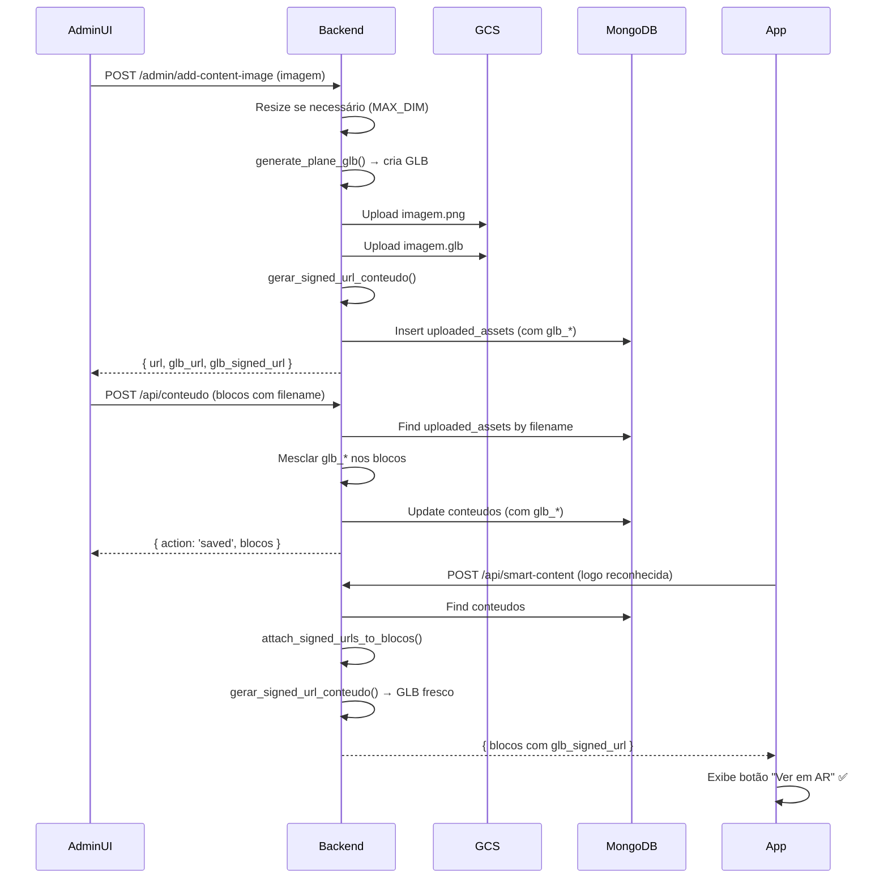

# 🎯 Geração Automática de GLBs

## 📋 **Resumo**

O sistema agora **gera GLBs automaticamente** ao fazer upload de imagens, garantindo que os botões "Ver em AR" apareçam corretamente no app mobile.

---

## ✅ **Como o Sistema Funciona**

### **1. Upload de Imagem** (`/admin/add-content-image`)

Quando uma imagem é enviada pelo AdminUI:

```python
# main.py - linhas 2915-2970
if not glb_url and file.content_type and file.content_type.startswith('image/'):
    # Gera GLB automaticamente
    glb_filename = f"{token['uid']}/ra/models/{name_base}.glb"
    
    # Processa imagem (resize se necessário)
    processed_image = await asyncio.to_thread(resize_image_if_needed, temp_path, MAX_IMAGE_DIM)
    
    # Gera GLB plano com textura
    generate_plane_glb(
        processed_image,
        glb_temp,
        base_y=0.0,
        plane_height=1.0,
        flip_u=False,
        flip_v=True
    )
    
    # Upload para GCS
    glb_gcs_url = upload_image_to_gcs(glb_temp, glb_filename, 'conteudo')
    
    # Gera signed URL (7 dias)
    glb_signed_url = gerar_signed_url_conteudo(glb_gcs_url, glb_filename, 7*24*60*60)
```

**Resultado**: Imagem + GLB salvos em `uploaded_assets`:
```json
{
  "filename": "TR77x.../imagem.png",
  "gs_url": "gs://olinxra-conteudo/TR77x.../imagem.png",
  "glb_url": "gs://olinxra-conteudo/TR77x.../ra/models/imagem.glb",
  "glb_filename": "TR77x.../ra/models/imagem.glb",
  "glb_source": "auto_generated"
}
```

---

### **2. Salvar Conteúdo** (`/api/conteudo`)

Quando o AdminUI salva o conteúdo:

```python
# main.py - linhas 2443-2542
# MESCLA campos GLB dos blocos antigos e uploaded_assets

# Indexa blocos antigos
old_by_filename = {}
for ob in old_blocos:
    fn = ob.get('filename')
    if fn:
        old_by_filename[str(fn)] = ob

# Busca em uploaded_assets
assets = await db['uploaded_assets'].find({
    'owner_uid': token.get('uid'),
    'filename': {'$in': list(filenames_to_lookup)}
}).to_list(length=1000)

for a in assets:
    old_by_filename[str(a.get('filename'))] = a

# Copia campos GLB para novos blocos
for nb in cleaned_blocos:
    fn = nb.get('filename')
    if fn and str(fn) in old_by_filename:
        matched = old_by_filename[str(fn)]
        # Preserva glb_url, glb_signed_url, glb_source
        for fld in ('glb_url', 'glb_signed_url', 'glb_source'):
            if fld in matched and (fld not in nb or nb.get(fld) in (None, '')):
                nb[fld] = matched.get(fld)
```

**Resultado**: Campos GLB preservados automaticamente no MongoDB.

---

### **3. Retornar Conteúdo** (`/api/smart-content`)

Quando o app mobile solicita conteúdo:

```python
# main.py - linhas 648-652
glb_url = it.get('glb_url')
if glb_url:
    # Gera signed URL fresca (7 dias)
    try:
        glb_signed = gerar_signed_url_conteudo(glb_url, get_glb_path_from_image_url(it_url), expiration)
        it['glb_signed_url'] = glb_signed
    except Exception as e:
        logging.warning(f"Erro ao gerar signed URL para GLB: {e}")
```

**Resultado**: App recebe `glb_signed_url` atualizada (sempre 7 dias de validade).

---

## 🔧 **Migração de Conteúdo Existente**

Para conteúdos criados **antes** dessa funcionalidade, use o script retroativo:

### **Script: `generate_carousel_glbs.py`**

```bash
cd olinxra-backend
python generate_carousel_glbs.py
```

**O que ele faz**:
1. Busca todos os itens de carousel sem `glb_url`
2. Baixa imagem do GCS
3. Gera GLB automaticamente
4. Faz upload para GCS
5. Atualiza documento no MongoDB

**Logs de execução**:
```
✅ Conteúdo g3 encontrado: 69094441ea3606f1a22b24d0
🎠 Processando carousel (Bloco 1) com 5 itens...
   🔨 Item 0: juninho-card.png
      📥 Baixando imagem...
      🖼️  Processando imagem...
      🔨 Gerando GLB...
      ☁️  Fazendo upload do GLB...
      🔐 Gerando signed URL...
      💾 Atualizando documento...
      ✅ GLB gerado e salvo: TR77x.../ra/models/juninho-card.glb
💾 Salvando alterações no MongoDB...
✅ Documento atualizado: 1 documento(s)
```

---

## 🔍 **Verificação**

### **Script: `check_mongo_glbs.py`**

```bash
python check_mongo_glbs.py
```

**Saída esperada**:
```
✅ Documento g3 encontrado: 69094441ea3606f1a22b24d0

📦 Bloco 1 (Carousel 1): 5 items

   Item 0: juninho-card.png
      ✅ glb_url: gs://olinxra-conteudo/TR77x.../ra/models/juninho-card.glb
      ✅ glb_filename: TR77x.../ra/models/juninho-card.glb
      ✅ glb_signed_url: https://storage.googleapis.com/...
      ✅ glb_source: auto_generated_retroactive
```

---

## 📊 **Estrutura de Dados**

### **MongoDB - Collection: `conteudos`**

```json
{
  "_id": "69094441ea3606f1a22b24d0",
  "nome_marca": "g3",
  "blocos": [
    {
      "tipo": "Carousel 1",
      "items": [
        {
          "nome": "juninho-card.png",
          "filename": "TR77xSOJrigOHfkoYQtx1iim6ok1/juninho-card.png",
          "url": "gs://olinxra-conteudo/TR77xSOJrigOHfkoYQtx1iim6ok1/juninho-card.png",
          "glb_url": "gs://olinxra-conteudo/TR77xSOJrigOHfkoYQtx1iim6ok1/ra/models/juninho-card.glb",
          "glb_filename": "TR77xSOJrigOHfkoYQtx1iim6ok1/ra/models/juninho-card.glb",
          "glb_signed_url": "https://storage.googleapis.com/...",
          "glb_source": "auto_generated_retroactive"
        }
      ]
    }
  ]
}
```

### **MongoDB - Collection: `uploaded_assets`**

```json
{
  "owner_uid": "TR77xSOJrigOHfkoYQtx1iim6ok1",
  "filename": "TR77xSOJrigOHfkoYQtx1iim6ok1/juninho-card.png",
  "gs_url": "gs://olinxra-conteudo/TR77xSOJrigOHfkoYQtx1iim6ok1/juninho-card.png",
  "glb_url": "gs://olinxra-conteudo/TR77xSOJrigOHfkoYQtx1iim6ok1/ra/models/juninho-card.glb",
  "glb_filename": "TR77xSOJrigOHfkoYQtx1iim6ok1/ra/models/juninho-card.glb",
  "glb_source": "auto_generated",
  "temp_id": "uuid-...",
  "attached": true,
  "created_at": "2025-11-06T15:29:10.000Z"
}
```

---

## ⚙️ **Configurações**

### **Variáveis de Ambiente**

```env
# Dimensão máxima da imagem no GLB (evita GLBs muito grandes)
GLB_MAX_DIM=2048

# Bucket do GCS para armazenamento
GCS_BUCKET_CONTEUDO=olinxra-conteudo
```

### **Limites do GCS**

- **Signed URL máxima**: 7 dias (604800 segundos)
- **Cache-Control**: `public, max-age=31536000` (1 ano)
- **Regeneração**: Automática a cada requisição `/api/smart-content`

---

## 🚀 **Fluxo Completo (Novo Conteúdo)**



---

## 🎯 **Resultado Final**

### **ANTES** (sem GLB):
```json
{
  "nome": "juninho-card.png",
  "url": "https://storage.googleapis.com/..."
  // ❌ Sem glb_url → Botão AR não aparece
}
```

### **DEPOIS** (com GLB automático):
```json
{
  "nome": "juninho-card.png",
  "url": "https://storage.googleapis.com/...",
  "glb_url": "gs://olinxra-conteudo/.../juninho-card.glb",
  "glb_signed_url": "https://storage.googleapis.com/...expires=...",
  "glb_source": "auto_generated"
  // ✅ Botão "Ver em AR" aparece!
}
```

---

## 📝 **Notas Importantes**

1. **GLBs são gerados APENAS para imagens** (`content_type.startswith('image/')`)
2. **Signed URLs expiram em 7 dias** (limite do GCS), mas são **regeneradas automaticamente** a cada consulta
3. **Conteúdo antigo** precisa rodar `generate_carousel_glbs.py` uma vez
4. **Novos uploads** já incluem GLB automaticamente
5. **AdminUI não precisa mudar nada** - tudo é transparente

---

## ✅ **Checklist de Deploy**

- [x] Backend gera GLBs no upload (`/admin/add-content-image`)
- [x] Backend preserva GLBs ao salvar (`/api/conteudo`)
- [x] Backend regenera signed URLs (`/api/smart-content`)
- [x] Script retroativo criado (`generate_carousel_glbs.py`)
- [x] Script de verificação criado (`check_mongo_glbs.py`)
- [x] Conteúdo G3 migrado (5 itens com GLB)
- [x] Documentação completa

---

## 🔄 **Próximos Passos**

1. **Deploy do backend** (geração automática já implementada)
2. **Testar no app mobile** (botões AR devem aparecer)
3. **Migrar outros conteúdos** (rodar script retroativo se necessário)
4. **Monitorar logs** (verificar geração de GLBs)

---

**Data**: 06/11/2025  
**Autor**: Copilot + Gibadalcin  
**Status**: ✅ Implementado e Testado
