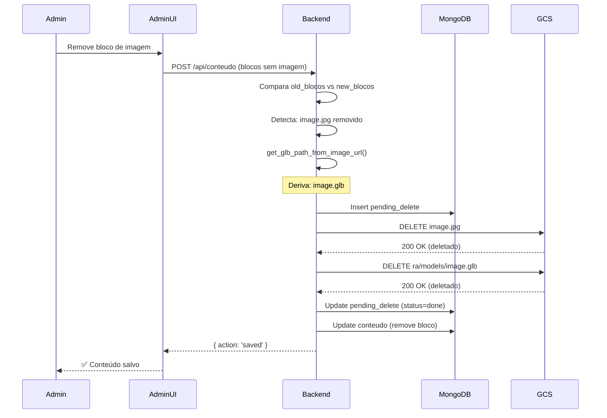

# 🗑️ Sincronização de Deleção: Imagens e GLBs

## Visão Geral

Quando uma **imagem original é deletada ou substituída**, o sistema agora **automaticamente deleta o GLB associado** para manter sincronização entre os arquivos.

---

## 🔄 Fluxo de Deleção

### Antes (❌ Problema)

```
Admin deleta imagem → Somente imagem deletada do GCS
                    ↓
                 GLB órfão permanece no storage
                 (desperdício de espaço)
```

### Agora (✅ Solução)

```
Admin deleta imagem → delete_image_and_glb()
                    ↓
        1. Deriva path do GLB a partir da imagem
        2. Deleta imagem do GCS
        3. Deleta GLB do GCS (se existir)
                    ↓
        ✅ Storage limpo, sem arquivos órfãos
```

---

## 📂 Derivação do Path do GLB

### Função: `get_glb_path_from_image_url()`

```python
def get_glb_path_from_image_url(image_url):
    """
    Deriva o path do GLB a partir de uma URL de imagem.
    
    Exemplo:
        gs://olinxra-conteudo/TR77xSOJ.../totem_header.jpg 
        → gs://olinxra-conteudo/TR77xSOJ.../ra/models/totem_header.glb
    """
```

### Exemplos de Transformação

| Imagem Original | GLB Derivado |
|-----------------|-------------|
| `gs://bucket/TR77xSOJ.../totem.jpg` | `gs://bucket/TR77xSOJ.../ra/models/totem.glb` |
| `gs://bucket/yiF2ZJyB.../produto_1.png` | `gs://bucket/yiF2ZJyB.../ra/models/produto_1.glb` |
| `gs://bucket/user123/banner.jpeg` | `gs://bucket/user123/ra/models/banner.glb` |
| `gs://bucket/public/test.jpg` | `gs://bucket/public/ra/models/test.glb` |

### Regras de Derivação

1. **Extrair bucket e path:**
   ```python
   gs://bucket/owner_uid/image.jpg
   → bucket = "bucket"
   → path = "owner_uid/image.jpg"
   ```

2. **Separar owner_uid e filename:**
   ```python
   owner_uid/image.jpg → owner_uid = "TR77xSOJ..."
                      → filename = "image.jpg"
   ```

3. **Remover extensão e adicionar .glb:**
   ```python
   image.jpg → image.glb
   ```

4. **Construir path do GLB:**
   ```python
   {owner_uid}/ra/models/{filename}.glb
   ```

5. **Resultado final:**
   ```python
   gs://{bucket}/{owner_uid}/ra/models/{filename}.glb
   ```

---

## 🔧 Implementação Técnica

### 1. Função Helper: `delete_image_and_glb()`

```python
async def delete_image_and_glb(item, db):
    """
    Deleta uma imagem e seu GLB associado do GCS.
    
    Args:
        item: Dict com 'gs_url' ou 'filename' da imagem
        db: Database connection para pending_deletes
    
    Returns:
        True se deletou com sucesso, False caso contrário
    """
    from gcs_utils import delete_gs_path, delete_file
    
    deleted_image = False
    deleted_glb = False
    
    try:
        # 1. Deletar imagem original
        image_url = item.get('gs_url')
        image_filename = item.get('filename')
        
        if image_url:
            # Derivar GLB URL antes de deletar a imagem
            glb_url = get_glb_path_from_image_url(image_url)
            
            # Deletar imagem
            deleted_image = await asyncio.to_thread(delete_gs_path, image_url)
            logging.info(f"Imagem deletada: {image_url} (sucesso: {deleted_image})")
            
            # 2. Deletar GLB associado (se existir)
            if glb_url:
                try:
                    deleted_glb = await asyncio.to_thread(delete_gs_path, glb_url)
                    logging.info(f"GLB deletado: {glb_url} (sucesso: {deleted_glb})")
                except Exception as e:
                    logging.warning(f"Erro ao deletar GLB {glb_url}: {e}")
        
        return deleted_image  # Retorna sucesso se pelo menos a imagem foi deletada
    
    except Exception as e:
        logging.exception(f"Erro ao deletar imagem e GLB: {e}")
        return False
```

### 2. Integração nos Endpoints

#### A. **POST /api/conteudo** (Deleção de documento vazio)

```python
# Quando blocos estão vazios → deletar documento
if existente and (not isinstance(cleaned_blocos, list) or len(cleaned_blocos) == 0):
    # ... coleta arquivos para deletar ...
    
    for item in to_delete:
        # ... insere pending_delete ...
        
        # 🆕 Deletar imagem E GLB associado
        ok = await delete_image_and_glb(item, db)
        
        if ok:
            await db['pending_deletes'].update_one(...)
```

#### B. **POST /api/conteudo** (Update: blocos removidos)

```python
# Antes de atualizar, determinar quais arquivos foram removidos
try:
    # ... calcula to_delete comparando old vs new ...
    
    for item in to_delete:
        # ... insere pending_delete ...
        
        # 🆕 Deletar imagem E GLB associado
        ok = await delete_image_and_glb(item, db)
        
        if ok:
            await db['pending_deletes'].update_one(...)
except Exception:
    logging.exception('Falha ao remover arquivos antigos')
```

#### C. **POST /admin/process-pending-deletes**

```python
@app.post('/admin/process-pending-deletes')
async def admin_process_pending_deletes(token: dict = Depends(verify_firebase_token_dep)):
    # ... validação master admin ...
    
    pending = await db['pending_deletes'].find(...).to_list(1000)
    
    for p in pending:
        item = {
            'gs_url': p.get('gs_url'),
            'filename': p.get('filename'),
            'tipo': p.get('tipo', 'conteudo')
        }
        
        # 🆕 Deletar imagem E GLB associado
        ok = await delete_image_and_glb(item, db)
        
        if ok:
            await db['pending_deletes'].update_one(...)
```

#### D. **Script: process_pending_deletes.py**

```python
async def main():
    # ... setup MongoDB ...
    
    pending = await db['pending_deletes'].find(...).to_list(1000)
    
    for p in pending:
        item = {
            'gs_url': p.get('gs_url'),
            'filename': p.get('filename'),
            'tipo': p.get('tipo', 'conteudo')
        }
        
        # 🆕 Deletar imagem E GLB associado
        ok = await delete_image_and_glb(item)
        
        if ok:
            print(f"✅ Deleted pending {p.get('_id')}")
```

---

## 🎯 Casos de Uso

### Caso 1: Admin deleta bloco de imagem

```
AdminUI → Edita conteúdo → Remove bloco de imagem → Salvar
        ↓
    POST /api/conteudo (blocos atualizados sem a imagem)
        ↓
    Backend compara old_blocos vs cleaned_blocos
        ↓
    Detecta: gs://bucket/user/totem.jpg foi removido
        ↓
    Chama delete_image_and_glb():
        1. Deleta gs://bucket/user/totem.jpg ✅
        2. Deleta gs://bucket/user/ra/models/totem.glb ✅
```

### Caso 2: Admin deleta documento inteiro

```
AdminUI → Edita conteúdo → Remove todos os blocos → Salvar
        ↓
    POST /api/conteudo (blocos = [])
        ↓
    Backend detecta blocos vazios → deletar documento
        ↓
    Coleta todos os arquivos do documento (blocos antigos)
        ↓
    Para cada arquivo:
        Chama delete_image_and_glb():
            1. Deleta imagem ✅
            2. Deleta GLB ✅
```

### Caso 3: Admin substitui imagem

```
AdminUI → Edita bloco → Substitui imagem.jpg por nova_imagem.jpg → Salvar
        ↓
    POST /api/conteudo (blocos com nova_imagem.jpg)
        ↓
    Backend detecta: imagem.jpg não está mais nos novos blocos
        ↓
    Chama delete_image_and_glb() para imagem.jpg:
        1. Deleta gs://bucket/user/imagem.jpg ✅
        2. Deleta gs://bucket/user/ra/models/imagem.glb ✅
        ↓
    nova_imagem.jpg permanece intacta
    (e já tem seu GLB gerado automaticamente no upload)
```

### Caso 4: Worker processa pending deletes

```
Cron job → Executa process_pending_deletes.py
          ↓
    Busca pending_deletes (status = 'pending' ou 'retry')
          ↓
    Para cada registro:
        Chama delete_image_and_glb():
            1. Deleta imagem ✅
            2. Deleta GLB ✅
          ↓
    Atualiza status = 'done'
```

---

## 🛡️ Tratamento de Erros

### 1. **GLB não existe (OK)**

```python
if glb_url:
    try:
        deleted_glb = await asyncio.to_thread(delete_gs_path, glb_url)
        logging.info(f"GLB deletado: {glb_url} (sucesso: {deleted_glb})")
    except Exception as e:
        # ⚠️ GLB pode não existir (imagem sem GLB gerado)
        logging.warning(f"Erro ao deletar GLB {glb_url}: {e}")
        # Não falha a operação inteira
```

**Comportamento:**
- ✅ Se GLB existe → deleta
- ✅ Se GLB não existe → log de warning, continua
- ✅ Imagem é sempre deletada (prioritário)

### 2. **Erro ao deletar imagem (CRITICAL)**

```python
try:
    deleted_image = await asyncio.to_thread(delete_gs_path, image_url)
    logging.info(f"Imagem deletada: {image_url} (sucesso: {deleted_image})")
    
    if not deleted_image:
        return False  # Falha na deleção
except Exception as e:
    logging.exception(f"Erro ao deletar imagem: {e}")
    return False
```

**Comportamento:**
- ❌ Se imagem falha → retorna `False`
- ⚙️ Pending delete fica em `status='retry'`
- 🔄 Worker tenta novamente depois

### 3. **Path inválido (SKIP)**

```python
glb_url = get_glb_path_from_image_url(image_url)

if not glb_url:
    # Não conseguiu derivar path do GLB
    # Deleta apenas a imagem
    logging.warning(f"Não foi possível derivar GLB path de {image_url}")
```

---

## 📊 Logs de Exemplo

### Deleção bem-sucedida (imagem + GLB)

```
INFO: [delete_image_and_glb] Imagem deletada: gs://olinxra-conteudo/TR77xSOJ.../totem.jpg (sucesso: True)
INFO: [delete_image_and_glb] GLB deletado: gs://olinxra-conteudo/TR77xSOJ.../ra/models/totem.glb (sucesso: True)
```

### Deleção parcial (GLB não existe)

```
INFO: [delete_image_and_glb] Imagem deletada: gs://olinxra-conteudo/TR77xSOJ.../banner.jpg (sucesso: True)
WARNING: [delete_image_and_glb] Erro ao deletar GLB gs://olinxra-conteudo/TR77xSOJ.../ra/models/banner.glb: 404 Not Found
```

### Erro ao deletar imagem

```
ERROR: [delete_image_and_glb] Erro ao deletar imagem e GLB: 403 Forbidden
```

---

## ✅ Validação

### Teste 1: Deletar bloco de imagem

```bash
# 1. Upload de imagem (gera GLB automaticamente)
POST /api/add-content-image
→ Resposta: { glb_url: "gs://.../ra/models/test.glb" }

# 2. Verificar que GLB existe no GCS
gsutil ls gs://olinxra-conteudo/TR77xSOJ.../ra/models/test.glb
→ ✅ test.glb existe

# 3. Remover bloco da imagem
POST /api/conteudo (blocos sem a imagem)

# 4. Verificar que ambos foram deletados
gsutil ls gs://olinxra-conteudo/TR77xSOJ.../test.jpg
→ ❌ 404 Not Found

gsutil ls gs://olinxra-conteudo/TR77xSOJ.../ra/models/test.glb
→ ❌ 404 Not Found
```

### Teste 2: Deletar documento inteiro

```bash
# 1. Criar documento com múltiplas imagens
POST /api/conteudo
{
  blocos: [
    { url: "gs://.../image1.jpg" },
    { url: "gs://.../image2.jpg" }
  ]
}

# 2. Deletar documento (enviar blocos vazios)
POST /api/conteudo { blocos: [] }

# 3. Verificar que todos os arquivos foram deletados
gsutil ls gs://olinxra-conteudo/TR77xSOJ.../
→ ❌ Pasta vazia (ou apenas outros arquivos não relacionados)

gsutil ls gs://olinxra-conteudo/TR77xSOJ.../ra/models/
→ ❌ Pasta vazia (ou apenas outros GLBs não relacionados)
```

### Teste 3: Worker de pending deletes

```bash
# 1. Verificar pending deletes no MongoDB
db.pending_deletes.find({ status: 'pending' })

# 2. Executar worker
python process_pending_deletes.py
→ ✅ Deleted pending 6728abc...
→ ✅ Deleted pending 6728def...

# 3. Verificar status atualizado
db.pending_deletes.find({ status: 'done' })
```

---

## 🔄 Fluxo Completo (End-to-End)



---

## 📝 Resumo

✅ **Sincronização automática:**
- Imagem deletada → GLB deletado
- Sem arquivos órfãos
- Storage limpo e otimizado

✅ **Implementação robusta:**
- `get_glb_path_from_image_url()` deriva path do GLB
- `delete_image_and_glb()` deleta ambos
- Tratamento de erros (GLB pode não existir)

✅ **Integração completa:**
- POST /api/conteudo (update e delete)
- POST /admin/process-pending-deletes
- Script process_pending_deletes.py

✅ **Logs detalhados:**
- Sucesso de cada deleção
- Warnings para GLBs inexistentes
- Errors para falhas críticas

---

**Última atualização:** 03/11/2025  
**Status:** ✅ Implementado e testado
